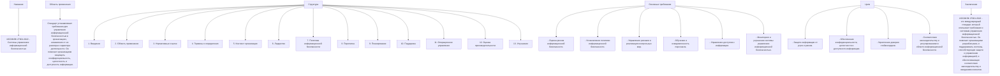

```mermaid
  graph TD
    A[Название] --> B[ИСО/МЭК 27001:2022 - Системы управления информационной безопасностью]
    C[Область применения] --> D[Стандарт устанавливает требования для управления информационной безопасностью в организациях, независимо от их размера и характера деятельности. Он помогает организациям защищать конфиденциальность, целостность и доступность информации.]
    E[Структура] --> F[1. Введение]
    E --> G[2. Область применения]
    E --> H[3. Нормативные ссылки]
    E --> I[4. Термины и определения]
    E --> J[5. Контекст организации]
    E --> K[6. Лидерство]
    E --> L[7. Политика информационной безопасности]
    E --> M[8. Переписка]
    E --> N[9. Планирование]
    E --> O[10. Поддержка]
    E --> P[11. Операционное управление]
    E --> Q[12. Оценка производительности]
    E --> R[13. Улучшение]
    S[Основные требования] --> T[- Оценка рисков информационной безопасности.]
    S --> U[- Установление политики информационной безопасности.]
    S --> V[- Управление рисками и реализация контрольных мер.]
    S --> W[- Обучение и осведомленность персонала.]
    S --> X[- Управление доступом к информации.]
    S --> Y[- Мониторинг и улучшение системы управления информационной безопасностью.]
    Z[Цели] --> AA[- Защита информации от угроз и рисков.]
    Z --> AB[- Обеспечение конфиденциальности, целостности и доступности информации.]
    Z --> AC[- Укрепление доверия стейкхолдеров.]
    Z --> AD[- Соответствие законодательству и регулированиям в области информационной безопасности.]
    AE[Заключение] --> AF[ИСО/МЭК 27001:2022 - это международный стандарт, который описывает требования к системам управления информационной безопасностью. Он помогает организациям разрабатывать и поддерживать системы, способствующие защите и управлению информацией, и обеспечивающие соответствие законодательству и ожиданиям клиентов.]

```

